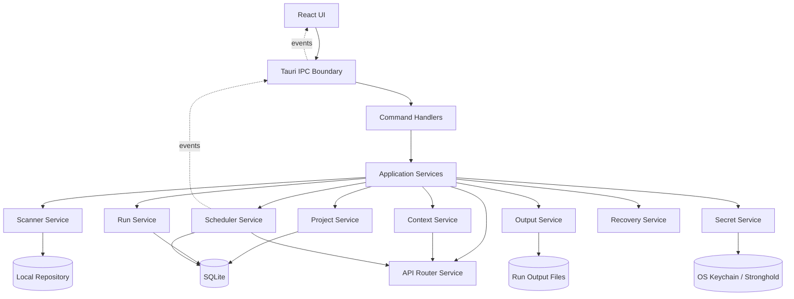
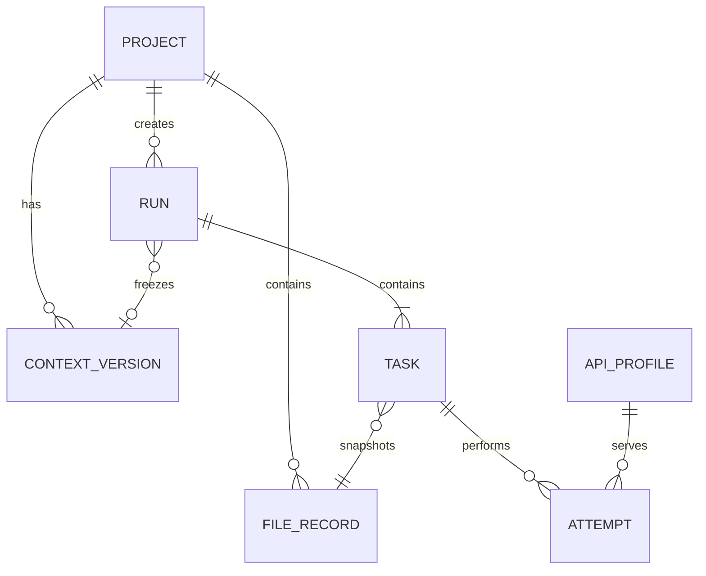

# 批量代码文件 AI 分析工具——技术架构设计（Architecture v1.0）

> 对应产品需求：`批量代码文件 AI 分析工具 - 产品需求文档（v1.1）`  
> 产品定位：本地桌面端批量文件分析工具，不承担 Git 开发过程反推，不修改源代码。  
> 目标平台：Windows、macOS、Linux。  
> 首选技术栈：Tauri 2 + React + Vite + TypeScript + Rust + SQLite。

---

## 1. 文档目标

本文档用于约束项目的技术实现方式，作为前端、Rust 核心、数据库、模型适配、跨平台打包和测试 Agent 的共同接口协议。

本文重点解决：

1. 桌面应用如何分层；
2. React 与 Rust 的职责边界；
3. Project、FileRecord、Run、Task、Attempt 如何持久化；
4. 文件扫描、任务调度、重试、主备 API 切换如何实现；
5. 应用异常退出后如何恢复且避免自动重复计费；
6. Windows、macOS、Linux 如何构建、签名和分发；
7. 多个开发 Agent 如何在不互相覆盖的情况下并行开发。

本文是技术实现的权威约束。若实现细节与 PRD 冲突，以 PRD 的产品行为为准；若多个模块对同一技术行为理解不一致，以本文的模块边界、状态机和 IPC 契约为准。

---

## 2. 核心技术决策

### 2.1 技术栈定案

| 层级 | 技术 | 作用 |
| --- | --- | --- |
| 桌面容器 | Tauri 2 | 窗口、IPC、权限、安装包、自动更新 |
| 前端 | React + Vite + TypeScript | 页面、表格、交互和状态展示 |
| UI | Tailwind CSS + shadcn/ui | 统一组件与主题 |
| 表格 | TanStack Table + TanStack Virtual | 10,000 行任务表和虚拟滚动 |
| 前端状态 | Zustand | UI 状态、当前项目、筛选条件 |
| 服务端状态 | TanStack Query | IPC 查询缓存和失效刷新，可选但推荐 |
| 编辑器 | CodeMirror 6 | 提示词、原始 Markdown 和 JSON 查看 |
| Markdown | react-markdown + remark-gfm + rehype-sanitize | 安全渲染模型结果 |
| 核心后端 | Rust | 文件系统、数据库、调度、网络和安全逻辑 |
| 异步运行时 | Tokio | 并发请求、暂停、取消、重试计时 |
| HTTP | reqwest | 模型 API 请求 |
| 序列化 | serde / serde_json | IPC、配置和输出文件 |
| 数据库 | SQLite + sqlx | 项目、文件、Run、Task、Attempt 权威状态 |
| 扫描 | ignore + walkdir 辅助 | `.gitignore` 和目录扫描 |
| 哈希 | BLAKE3 | 文件变化识别；外部导出可同时保存 SHA-256 |
| 密钥 | keyring 抽象 + Stronghold 降级 | API Key 安全存储 |
| 日志 | tracing + tracing-appender | 结构化、滚动和脱敏日志 |
| 取消 | tokio-util CancellationToken | Run 和 Task 取消 |
| 构建 | pnpm + Cargo | 前后端依赖管理 |
| CI/CD | GitHub Actions + tauri-action | 三平台测试、构建和发布 |

### 2.2 不使用 Next.js

本项目不需要 SSR、SEO、服务端路由或 React Server Components。使用 React + Vite 可以减少构建复杂度，并让前端作为纯静态资源嵌入 Tauri。

### 2.3 不使用 Tauri 前端文件系统 API 处理仓库

前端不得直接扫描或读取用户仓库。所有仓库文件操作必须经过 Rust 命令层，以确保：

- 路径规范化和仓库边界检查；
- 符号链接与 Junction 防护；
- 敏感文件扫描；
- 权限审计；
- 错误分类一致；
- 未来 CLI 或其他界面可复用核心能力。

### 2.4 SQLite 是运行状态的权威来源

SQLite 保存：

- 项目登记；
- API 档案非敏感元数据；
- FileRecord；
- ContextVersion；
- Run；
- Task；
- Attempt；
- 当前状态和恢复信息。

JSON/Markdown 用于：

- 仓库内可迁移项目配置；
- Run 输出清单；
- 用户可读结果；
- 导出与备份。

禁止以 `tasks.json` 作为运行时唯一状态源。任务状态变化必须先提交 SQLite，再异步刷新导出文件。

### 2.5 单进程、单活动 Run

首期采用：

- 一个桌面应用主进程；
- 全客户端同一时间仅允许一个活动 Run；
- 一个统一请求调度器；
- 所有模型请求共享全局并发槽位。

该限制显著降低跨项目调度、限流和恢复复杂度。架构中仍保留 `project_id` 和 `run_id`，后续可扩展多 Run 并行。

---

## 3. 总体架构



### 3.1 分层规则

```text
Presentation Layer
  React 页面、组件、表格和交互

IPC Layer
  Tauri Command、Event、DTO、错误映射

Application Layer
  用例编排：扫描、创建 Run、暂停、恢复、重试

Domain Layer
  状态机、实体、值对象、错误码、策略接口

Infrastructure Layer
  SQLite、文件系统、HTTP、密钥存储、日志、系统能力
```

依赖方向必须从外层指向内层接口：

```text
UI -> IPC -> Application -> Domain
Infrastructure -> Domain interfaces
```

Domain 层不能依赖 Tauri、React、SQLite 或具体模型厂商。

---

## 4. 运行进程与线程模型

### 4.1 进程模型

首期仅包含一个 Tauri 应用进程：

- WebView：运行 React；
- Rust 主线程：窗口和 Tauri 生命周期；
- Tokio Runtime：网络请求、调度和数据库异步任务；
- Blocking Pool：目录扫描、文件哈希、编码检测等阻塞工作。

首期不额外创建 sidecar 进程。若后续出现超大型仓库、语法解析或插件隔离需求，再引入独立 worker sidecar。

### 4.2 禁止阻塞 UI

以下工作不得在 WebView 主线程或 Rust UI 主线程同步执行：

- 仓库递归扫描；
- 批量哈希；
- 读取大型文件；
- Token 估算；
- SQLite 大批量写入；
- Markdown 文件输出；
- API 调用；
- 日志压缩。

CPU 或磁盘阻塞操作使用 `spawn_blocking`；长任务通过 Event 推送阶段进度。

---

## 5. 代码仓库目录

```text
batch-code-analyzer/
├─ apps/
│  └─ desktop/
│     ├─ src/                         # React 前端
│     │  ├─ app/
│     │  ├─ pages/
│     │  ├─ features/
│     │  ├─ components/
│     │  ├─ stores/
│     │  ├─ ipc/
│     │  ├─ types/
│     │  └─ test/
│     ├─ src-tauri/
│     │  ├─ capabilities/
│     │  ├─ icons/
│     │  ├─ migrations/
│     │  ├─ src/
│     │  │  ├─ commands/
│     │  │  ├─ application/
│     │  │  ├─ domain/
│     │  │  ├─ infrastructure/
│     │  │  ├─ security/
│     │  │  ├─ state/
│     │  │  ├─ errors/
│     │  │  ├─ lib.rs
│     │  │  └─ main.rs
│     │  ├─ Cargo.toml
│     │  └─ tauri.conf.json
│     ├─ package.json
│     └─ vite.config.ts
│
├─ crates/
│  ├─ domain/                         # 纯 Rust 领域实体和状态机
│  ├─ app-core/                       # 用例服务与应用编排
│  ├─ persistence/                    # SQLite Repository 实现
│  ├─ repository-scanner/             # 扫描、ignore、编码和哈希
│  ├─ model-providers/                # Responses API Adapter
│  ├─ task-scheduler/                 # 调度、重试、路由、取消
│  ├─ output-writer/                  # manifest、results、JSONL
│  └─ security-core/                  # 路径、脱敏、敏感内容扫描
│
├─ packages/
│  ├─ ui/                             # 可复用 React UI
│  └─ ipc-types/                      # 生成后的 TypeScript DTO
│
├─ docs/
│  ├─ prd.md
│  ├─ architecture.md
│  ├─ adr/
│  ├─ ipc-contract.md
│  └─ testing.md
│
├─ scripts/
├─ .github/workflows/
├─ pnpm-workspace.yaml
├─ Cargo.toml                         # Rust workspace
├─ rust-toolchain.toml
├─ package.json
└─ README.md
```

### 5.1 Workspace 原则

- Rust 使用 Cargo Workspace；
- Web 使用 pnpm Workspace；
- `apps/desktop` 只负责组合，不承载大量领域逻辑；
- 每个 crate 必须有明确公开接口；
- 跨 crate 只通过领域类型或 Trait 交互；
- 禁止所有代码集中在 `src-tauri/src/lib.rs`。

---

## 6. 领域模型

### 6.1 聚合关系



### 6.2 实体职责

#### Project

保存项目当前默认配置，不保存某次运行的动态状态。

#### FileRecord

保存扫描得到的当前文件事实。它描述“现在的仓库”，不是某次 Run 的文件快照。

#### Run

保存一次正式批量执行的配置快照和整体状态。

#### Task

保存某个 Run 对一个文件的分析快照和最终状态。

#### Attempt

保存一次真实网络请求。所有自动重试、备用档案切换和人工重试都必须新增 Attempt。

#### ContextVersion

保存项目上下文摘要的不可变版本。

### 6.3 不可变规则

Run 创建后，下列字段不可修改：

- 文件列表；
- Task 的文件哈希；
- Task 的提示词快照；
- Task 的模型快照；
- ContextVersion；
- API 路由顺序；
- 并发数；
- 重试策略；
- 应用版本；
- Schema 版本。

可以变化的字段仅限：

- Run 状态；
- Task 状态；
- Attempt 追加；
- 统计值；
- 结果文件路径；
- 用户对主结果版本的选择。

---

## 7. SQLite 数据设计

### 7.1 数据库位置

数据库位于操作系统应用数据目录：

```text
Windows: %APPDATA%/<AppName>/app.db
macOS:   ~/Library/Application Support/<AppName>/app.db
Linux:   ~/.local/share/<AppName>/app.db
```

仓库不可用时，历史 Run 仍可从 SQLite 查看。

### 7.2 SQLite 配置

启动时执行：

```sql
PRAGMA foreign_keys = ON;
PRAGMA journal_mode = WAL;
PRAGMA synchronous = NORMAL;
PRAGMA busy_timeout = 5000;
```

建议使用一个小型连接池。写操作必须通过 Repository 事务完成，避免多个模块直接执行零散 SQL。

### 7.3 核心表

以下为逻辑 Schema，具体迁移文件可根据 sqlx 调整。

```sql
CREATE TABLE projects (
  id TEXT PRIMARY KEY,
  schema_version INTEGER NOT NULL,
  name TEXT NOT NULL,
  source_directory TEXT NOT NULL,
  canonical_source_directory TEXT NOT NULL UNIQUE,
  path_status TEXT NOT NULL,
  default_prompt TEXT NOT NULL,
  default_model TEXT,
  context_model TEXT,
  output_root TEXT,
  filter_rules_json TEXT NOT NULL,
  execution_defaults_json TEXT NOT NULL,
  api_routing_json TEXT NOT NULL,
  current_context_version_id TEXT,
  context_enabled INTEGER NOT NULL DEFAULT 1,
  created_at TEXT NOT NULL,
  updated_at TEXT NOT NULL,
  last_opened_at TEXT NOT NULL
);

CREATE TABLE api_profiles (
  id TEXT PRIMARY KEY,
  name TEXT NOT NULL UNIQUE,
  protocol TEXT NOT NULL,
  base_url TEXT NOT NULL,
  key_reference_id TEXT,
  sensitive_header_reference_id TEXT,
  default_model TEXT,
  model_cache_json TEXT,
  model_cache_updated_at TEXT,
  last_connection_status TEXT,
  last_error_code TEXT,
  last_tested_at TEXT,
  created_at TEXT NOT NULL,
  updated_at TEXT NOT NULL
);

CREATE TABLE file_records (
  id TEXT PRIMARY KEY,
  project_id TEXT NOT NULL REFERENCES projects(id) ON DELETE CASCADE,
  relative_path TEXT NOT NULL,
  normalized_relative_path TEXT NOT NULL,
  size_bytes INTEGER NOT NULL,
  modified_at TEXT,
  content_hash TEXT,
  encoding TEXT,
  language TEXT,
  source_status TEXT NOT NULL,
  included INTEGER NOT NULL,
  exclusion_reason TEXT,
  sensitive_findings_json TEXT NOT NULL DEFAULT '[]',
  result_status TEXT NOT NULL,
  latest_successful_task_id TEXT,
  scan_generation INTEGER NOT NULL,
  created_at TEXT NOT NULL,
  updated_at TEXT NOT NULL,
  UNIQUE(project_id, normalized_relative_path)
);

CREATE TABLE context_versions (
  id TEXT PRIMARY KEY,
  project_id TEXT NOT NULL REFERENCES projects(id) ON DELETE CASCADE,
  status TEXT NOT NULL,
  model TEXT,
  source_files_json TEXT NOT NULL,
  summary TEXT NOT NULL,
  summary_hash TEXT NOT NULL,
  manually_edited INTEGER NOT NULL,
  created_at TEXT NOT NULL
);

CREATE TABLE runs (
  id TEXT PRIMARY KEY,
  project_id TEXT NOT NULL REFERENCES projects(id) ON DELETE CASCADE,
  status TEXT NOT NULL,
  context_version_id TEXT REFERENCES context_versions(id),
  output_directory TEXT NOT NULL,
  snapshot_json TEXT NOT NULL,
  stats_json TEXT NOT NULL,
  created_at TEXT NOT NULL,
  started_at TEXT,
  completed_at TEXT,
  interruption_reason TEXT
);

CREATE TABLE tasks (
  id TEXT PRIMARY KEY,
  run_id TEXT NOT NULL REFERENCES runs(id) ON DELETE CASCADE,
  file_id TEXT NOT NULL REFERENCES file_records(id),
  relative_path TEXT NOT NULL,
  file_snapshot_json TEXT NOT NULL,
  prompt_snapshot TEXT NOT NULL,
  prompt_hash TEXT NOT NULL,
  prompt_source TEXT NOT NULL,
  model_snapshot TEXT NOT NULL,
  model_source TEXT NOT NULL,
  context_version_id TEXT,
  status TEXT NOT NULL,
  current_result_path TEXT,
  latest_attempt_id TEXT,
  parent_task_id TEXT REFERENCES tasks(id),
  result_version INTEGER NOT NULL DEFAULT 1,
  created_at TEXT NOT NULL,
  started_at TEXT,
  completed_at TEXT
);

CREATE TABLE attempts (
  id TEXT PRIMARY KEY,
  task_id TEXT NOT NULL REFERENCES tasks(id) ON DELETE CASCADE,
  sequence INTEGER NOT NULL,
  api_profile_id TEXT NOT NULL,
  api_profile_name_snapshot TEXT NOT NULL,
  actual_model TEXT NOT NULL,
  status TEXT NOT NULL,
  request_started_at TEXT NOT NULL,
  request_dispatched_at TEXT,
  finished_at TEXT,
  duration_ms INTEGER,
  http_status INTEGER,
  input_tokens INTEGER,
  output_tokens INTEGER,
  total_tokens INTEGER,
  retry_reason TEXT,
  error_code TEXT,
  sanitized_error_message TEXT,
  response_id TEXT,
  UNIQUE(task_id, sequence)
);

CREATE TABLE prompt_library (
  id TEXT PRIMARY KEY,
  name TEXT NOT NULL UNIQUE,
  content TEXT NOT NULL,
  is_builtin INTEGER NOT NULL,
  created_at TEXT NOT NULL,
  updated_at TEXT NOT NULL
);

CREATE TABLE app_settings (
  key TEXT PRIMARY KEY,
  value_json TEXT NOT NULL,
  updated_at TEXT NOT NULL
);
```

### 7.4 索引

```sql
CREATE INDEX idx_files_project_status
ON file_records(project_id, source_status, result_status);

CREATE INDEX idx_runs_project_created
ON runs(project_id, created_at DESC);

CREATE INDEX idx_tasks_run_status
ON tasks(run_id, status);

CREATE INDEX idx_tasks_file
ON tasks(file_id, created_at DESC);

CREATE INDEX idx_attempts_task_sequence
ON attempts(task_id, sequence);
```

### 7.5 状态统计

Run 统计以 SQL 查询为最终校验来源。运行期间可在内存缓存增量统计，但每次应用启动和 Run 结束时必须从 Task 表重新计算，避免崩溃后统计漂移。

### 7.6 数据迁移

- 每个迁移文件只执行一次；
- 应用启动先备份数据库，再执行迁移；
- 迁移失败进入只读恢复模式；
- 不允许自动删除用户数据；
- Schema 降级不支持，旧版应用检测到更高 Schema 时必须拒绝写入。

---

## 8. 仓库配置和输出文件

### 8.1 仓库配置

```text
<repo>/.batch-analysis/
  project.json
  context.json
  files.json
```

这些文件是可迁移镜像，不是运行时唯一状态源。

写入规则：

1. 写入 `*.tmp`；
2. `fsync` 或等价刷新；
3. 原文件复制为 `.bak`；
4. 原子替换；
5. 更新失败记录日志并保留 SQLite 状态。

### 8.2 Run 输出

```text
<outputRoot>/runs/<timestamp>-run-<shortId>/
  manifest.json
  tasks.json
  attempts.jsonl
  import-report.json
  results/
    <safe-relative-path>.md
  history/
    <task-id>/
```

### 8.3 输出同步策略

- Task 成功：先原子写入 Markdown，再提交数据库结果路径；
- Attempt 完成：先提交 SQLite，再追加 `attempts.jsonl`；
- Run 状态更新：SQLite 立即写，`manifest.json` 采用节流刷新；
- Run 完成：重新生成完整 `manifest.json` 和 `tasks.json`；
- 导出失败不改变模型请求成功状态，但 Run 显示“结果导出异常”。

### 8.4 路径映射

结果路径必须由 Rust `SafePathMapper` 统一生成：

- 保留原文件扩展名，再追加 `.md`；
- 规范化分隔符；
- 转义 Windows 非法字符；
- 处理 `CON`、`NUL`、`COM1` 等保留名；
- 控制单段和总路径长度；
- 大小写冲突或转义冲突时追加短哈希；
- 最终 canonical path 必须位于 Run 的 `results` 根目录内。

---

## 9. React 前端架构

### 9.1 页面结构

```text
AppShell
├─ GlobalRunBar
├─ ProjectSidebar
└─ ProjectWorkspace
   ├─ ProjectHeader
   ├─ PromptTab
   │  ├─ PromptEditor
   │  ├─ PromptLibrary
   │  ├─ PromptGenerator
   │  ├─ ContextPanel
   │  └─ RandomTestPanel
   ├─ ApiConfigTab
   │  ├─ ApiProfiles
   │  ├─ RoutingEditor
   │  └─ ExecutionSettings
   └─ TaskArea
      ├─ ScanSummary
      ├─ FilterToolbar
      ├─ VirtualTaskTable
      ├─ TaskDetailDrawer
      └─ MarkdownPreviewDialog
```

### 9.2 前端状态划分

#### Zustand 保存 UI 状态

- 当前项目 ID；
- 当前 Tab；
- 表格筛选、排序和列宽；
- 已选行；
- 抽屉和弹窗状态；
- 未提交的提示词编辑内容；
- 用户主题和布局偏好。

#### Rust/SQLite 保存业务状态

- 项目；
- 文件记录；
- Run；
- Task；
- Attempt；
- API 档案；
- ContextVersion。

前端不得将业务状态只保存在 Zustand 中。

### 9.3 查询模式

推荐使用 TanStack Query 包装 IPC：

```text
query: listProjects
query: getProject
query: listFiles
query: listRuns
query: listTasks
query: getTaskDetail
mutation: updateProject
mutation: createRun
mutation: pauseRun
...
```

Rust Event 到达后，前端只更新受影响查询缓存或执行精确失效，禁止每条 Task 更新都重新加载整张表。

### 9.4 10,000 行表格

- 使用虚拟行；
- 单元格只显示摘要，不内嵌完整编辑器；
- 详细编辑进入 Drawer；
- 分页查询不是强制要求，但 IPC 必须支持游标或 offset/limit；
- 状态更新按 Task ID 局部合并；
- Markdown 结果按需加载；
- 关闭预览后释放大文本引用。

### 9.5 Markdown 安全

渲染链：

```text
react-markdown
  + remark-gfm
  + rehype-sanitize
  + 自定义 link/image renderer
```

规则：

- 不启用任意 raw HTML；
- 外部链接交由 Rust `open_external_url` 校验后打开；
- 默认不加载远程图片；
- 不允许 `file:`、`javascript:`、`data:text/html`；
- 代码块无运行按钮。

---

## 10. Tauri IPC 设计

### 10.1 原则

- 命令用于请求—响应；
- Event 用于长任务进度和状态变化；
- 前端不直接调用低级文件系统插件；
- 所有 DTO 都包含稳定字段和可枚举错误码；
- Rust 领域错误在 Command 边界转换为 `IpcError`；
- 不把 Rust 内部路径、数据库错误或服务原始错误直接暴露给 UI。

### 10.2 Command 命名

统一使用：

```text
project_list
project_add
project_update
project_remove
project_relocate

scan_start
scan_cancel
scan_get_report

context_generate
context_update_manual
context_get

api_profile_list
api_profile_save
api_profile_test
api_profile_delete
api_models_fetch

run_preview
run_create
run_pause
run_resume
run_cancel
run_get
run_list

file_list
file_update_override
file_set_included

task_list
task_get_detail
task_retry
task_regenerate
task_cancel

result_read
result_open_in_folder

app_get_settings
app_update_settings
health_check
```

### 10.3 Event 命名

```text
scan://progress
scan://completed
scan://failed

run://state-changed
run://stats-changed
run://completed

task://state-changed
task://attempt-started
task://attempt-finished
task://result-written

context://state-changed
api-profile://health-changed
app://fatal-error
```

### 10.4 Event Payload 示例

```json
{
  "schemaVersion": 1,
  "runId": "run-uuid",
  "taskId": "task-uuid",
  "previousStatus": "queued",
  "status": "running",
  "updatedAt": "2026-07-15T10:38:30Z"
}
```

### 10.5 DTO 类型同步

Rust 是 DTO 的权威来源。构建阶段自动生成 TypeScript 类型到 `packages/ipc-types`。

可采用 `ts-rs`，或使用经过验证的 Tauri 类型绑定方案。无论采用哪种工具，必须满足：

- CI 检查生成文件是否最新；
- 枚举值禁止前后端手写两份；
- `schemaVersion` 可用于兼容旧事件；
- 破坏性 IPC 修改必须记录 ADR 并升级 Schema。

### 10.6 分页契约

任务列表命令不得一次返回全部结果正文：

```ts
interface TaskListRequest {
  runId: string;
  cursor?: string;
  limit: number;              // 最大 500
  filters: TaskFilters;
  sort: TaskSort[];
}

interface TaskListResponse {
  items: TaskSummary[];
  nextCursor?: string;
  total: number;
}
```

---

## 11. Rust 核心模块

### 11.1 ProjectService

职责：

- 添加、移除、重定位项目；
- canonical path 去重；
- 加载仓库配置；
- 仓库不可写时切换到应用目录；
- 保存项目默认设置；
- 校验是否存在活动 Run。

不负责：扫描文件、执行模型请求。

### 11.2 ScannerService

职责：

- 递归目录扫描；
- 嵌套 `.gitignore`；
- 内置和用户过滤；
- 符号链接、Junction 和路径边界；
- 二进制、编码和大小检测；
- 敏感内容检测；
- 文件哈希；
- 新增、修改、删除比较；
- 导入报告。

### 11.3 ContextService

职责：

- 发现 README、AGENTS.md 和用户资料；
- 控制资料优先级和 Token 上限；
- 生成 ContextVersion；
- 人工编辑生成新版本；
- 检测来源文件变化并标记过期；
- 保存来源哈希和引用。

### 11.4 RunService

职责：

- 启动前检查；
- 创建 Run 快照；
- 批量创建 Task；
- 输出目录预创建；
- Run 状态转换；
- Run 汇总统计；
- 结束后最终导出。

### 11.5 SchedulerService

职责：

- 维护全局活动 Run；
- 控制并发；
- 从数据库拉取下一批 queued Task；
- 暂停、继续和取消；
- 调用 ApiRouter；
- 写入 Attempt；
- 执行退避等待；
- 处理应用关闭和取消 Token。

### 11.6 ApiRouterService

职责：

- 根据 Run 快照读取主备档案；
- 模型策略解析；
- 错误分类；
- 档案健康状态；
- 重试和切换决策；
- 统一 Token 和响应元数据。

### 11.7 ProviderAdapter

协议接口：

```rust
#[async_trait]
pub trait ModelProvider: Send + Sync {
    async fn list_models(
        &self,
        profile: &ResolvedApiProfile,
    ) -> Result<Vec<ModelInfo>, ProviderError>;

    async fn execute(
        &self,
        request: ProviderRequest,
        cancel: CancellationToken,
    ) -> Result<ProviderResponse, ProviderError>;

    fn classify_error(&self, error: &ProviderError) -> ErrorClassification;
}
```

首期实现：

```text
OpenAiResponsesAdapter
```

未来实现：

```text
OpenAiChatCompletionsAdapter
AnthropicMessagesAdapter
LocalModelAdapter
```

### 11.8 OutputService

职责：

- 安全路径映射；
- 原子写结果；
- 追加 Attempt JSONL；
- 节流生成 manifest；
- Run 结束完整导出；
- 打开结果文件和目录。

### 11.9 SecretService

职责：

- 保存、读取和删除 API Key；
- 共享引用计数；
- OS Keychain 可用性检测；
- Stronghold 降级；
- 会话临时密钥；
- 禁止密钥进入 Debug 输出。

### 11.10 RecoveryService

职责：

- 启动时检查未完成 Run；
- 将残留 `running` Attempt 标记为 `interrupted`；
- 将对应 Task 标记为 `interrupted`；
- 重算 Run 统计；
- 检测 `.tmp`、`.bak` 和输出不一致；
- 向 UI 返回恢复建议，不自动重发。

---

## 12. 文件扫描管线


### 12.1 扫描代次

每次扫描生成递增的 `scan_generation`：

1. 扫描到文件时写入本代 generation；
2. 扫描完成后，本项目中旧 generation 且未出现的文件标记为 deleted；
3. 若扫描被取消或失败，不执行删除结算；
4. 批量写入放在事务中。

### 12.2 哈希策略

快速扫描：

- 先比较路径、大小和修改时间；
- 变化时计算 BLAKE3；
- Run 创建时目标文件必须具有内容哈希；
- 实际发送前再次核对哈希。

严谨模式可配置为每次扫描全部重新哈希，但不作为默认。

### 12.3 文件内容快照

PRD 默认不保存完整源文件副本。Run 创建后到发送前文件发生变化时：

- 默认不保留旧内容；
- Task 标记为 `source_changed`；
- “使用旧快照”只有在项目启用了“保存 Run 文件快照”时可用；
- 未启用快照时，UI 只提供跳过或创建新 Run。

这条规则必须在 UI 中真实反映，不能承诺不存在的旧文件内容。

---

## 13. 请求构造

### 13.1 内部分段

`RequestAssembler` 接收：

- 系统安全约束；
- ContextVersion；
- Task 提示词；
- 文件相对路径；
- 文件内容；
- 输出限制。

组装时保持明确边界：

```text
SYSTEM / DEVELOPER SAFETY
PROJECT MATERIAL
USER TASK
TARGET FILE PATH
TARGET FILE CONTENT
OUTPUT REQUIREMENTS
```

项目资料和代码都视作不可信数据，不允许覆盖系统约束。

### 13.2 Token 预估

定义 `TokenEstimator` 接口：

```rust
pub trait TokenEstimator {
    fn estimate(&self, model: &str, text: &str) -> TokenEstimate;
}
```

当无法识别模型 tokenizer 时，采用保守字符估算并增加安全余量。发送前判断：

```text
estimated_input
+ max_output_tokens
+ protocol_overhead
<= model_context_limit
```

模型上下文上限来源优先级：

1. API 返回能力元数据；
2. 应用内置模型元数据；
3. API 档案用户手动配置；
4. 未知时给出警告并使用项目保守上限。

### 13.3 不记录完整请求

默认日志仅记录：

- Task ID；
- 文件路径；
- 提示词哈希；
- 文件哈希；
- ContextVersion；
- 模型；
- Token；
- 状态。

源文件内容和完整提示词不进入普通日志。

---

## 14. 任务调度器

### 14.1 调度循环

```text
1. 读取活动 Run
2. 检查 Run 是否 running
3. 计算剩余并发槽位
4. 事务性领取 queued Task
5. 为每个 Task 创建执行 Future
6. Task 完成后更新数据库和统计
7. 发出局部 Event
8. 无待处理任务且无在飞请求时结束 Run
```

### 14.2 任务领取

即使首期为单进程，也必须避免同一 Task 被重复领取：

```text
事务开始
  SELECT pending/queued tasks
  UPDATE selected tasks SET status = running
事务提交
启动网络 Future
```

### 14.3 并发控制

正式 Run 使用有界 Tokio worker 集合：

- 项目设置接受 `1..=30` 的整数并发值，新项目默认值为 `3`；该范围必须由 Rust
  领域服务校验，前端约束只用于即时反馈；
- worker 上限读取 Run 创建时冻结的 `snapshot.concurrency`，项目设置变化不修改既有 Run；
- 只有 worker 槽位空闲时才能事务性领取下一个 queued Task；
- 单 Task 的自动重试和退避始终留在原 worker 内，不额外占用第二个槽位；
- 所有 worker 收敛且队列为空后，才能计算最终统计并结束 Run；
- 兼容旧数据时将 `concurrency = 0` 安全视为 `1`，避免 Run 永久排队；
- 执行器内部失败时停止领取，等待 worker 收敛，并原子地将已领取 Task 标记为中断。
- HTTP 请求可以并发，但同一进程的 SQLite 写事务通过共享异步门闩串行提交，避免多个
  延迟事务从读取升级为写入时产生 `SQLITE_BUSY`；普通只读查询不经过该门闩。

后续统一请求调度器仍使用全局 Semaphore：

- `global_request_semaphore`：Run 文件请求和辅助请求的统一全局上限；
- 辅助请求也使用统一调度队列；
- 并发调低时不撤销已持有 permit；
- 新请求等待 permit；
- Run 暂停时停止领取新 Task。

### 14.4 自动重试与主备切换

每个 Task 的执行算法：

```text
for profile in resolved routing chain:
  if profile unhealthy for this Run:
    continue

  resolve actual model
  if model unavailable:
    append failed Attempt
    continue

  for retry_index in 0..=retry_count:
    create Attempt row before dispatch
    dispatch request

    success:
      persist response and result
      mark Task succeeded
      return

    local/non-switchable error:
      mark Task failed
      return

    retryable and retries remain:
      wait Retry-After or backoff
      continue

    retry exhausted:
      update profile health
      break to next profile

mark Task failed with aggregated attempts
```

人工重试失败 Task 时复用同一个执行算法和 Run 快照。重新派发前必须在单个数据库
事务中完成：

```text
校验 Task 属于请求 Project 且状态为 Failed
→ 校验最新 Attempt.error.retryable = true
→ 校验父 Run 为 CompletedWithErrors 且不存在其他活动 Run
→ Run: CompletedWithErrors -> Running，清空 completedAt
→ Task: Failed -> Queued，清空 startedAt/completedAt
→ 重算并写入 RunStats
→ 提交事务
→ 统一执行器领取 Task，并在真实请求前追加新 Attempt
```

事务失败不得留下 Running Run 或 Queued Task。实际发送前必须重新核对源码哈希；若与
Task 文件快照不一致，Task 进入 `SourceChanged`，不创建 Attempt、不发送请求。

### 14.5 档案健康状态

健康状态只在当前 Run 内生效：

```text
healthy
cooldown(until)
authentication_failed
account_permission_failed
model_unavailable(model)
disabled
```

新 Run 重新初始化健康状态，但保留 API 档案最近测试结果用于启动前提示。

### 14.6 取消语义

- `RunCancellationToken`：取消整个 Run；
- `TaskCancellationToken`：取消单个 Task；
- Run 级取消使用单个数据库事务和集合更新，一次收敛该 Run 的全部 queued/running Task，
  不按 Task 数量循环调用 IPC；
- reqwest 请求 Future 被 drop 后 Attempt 标记为 cancelled 或 interrupted；
- 若无法判断服务端是否已完成，使用 `interrupted_unknown`；
- 不自动重发结果未知请求。

---

## 15. 状态机实现

### 15.1 Run 状态枚举

```rust
pub enum RunStatus {
    Draft,
    Running,
    Pausing,
    Paused,
    Cancelling,
    Cancelled,
    Completed,
    CompletedWithErrors,
    Interrupted,
}
```

### 15.2 Task 状态枚举

```rust
pub enum TaskStatus {
    Pending,
    Queued,
    Running,
    Succeeded,
    Failed,
    Cancelled,
    Interrupted,
    SourceChanged,
}
```

### 15.3 状态转换服务

禁止任意模块直接更新状态字符串。所有状态变化必须通过：

```rust
RunStateMachine::transition(from, event)
TaskStateMachine::transition(from, event)
```

非法转换返回稳定错误码，例如：

```text
run_invalid_transition
task_already_running
task_cannot_retry
run_not_active
```

### 15.4 数据库和 Event 顺序

```text
1. 数据库事务提交状态
2. 更新内存状态
3. 发出 Tauri Event
```

不得先更新 UI 再尝试写数据库。

---

## 16. 错误模型

### 16.1 统一错误结构

```json
{
  "code": "provider_rate_limited",
  "category": "provider",
  "message": "请求受到限流",
  "retryable": true,
  "switchProfile": true,
  "details": {
    "httpStatus": 429,
    "retryAfterSeconds": 10
  },
  "correlationId": "uuid"
}
```

### 16.2 错误分层

```text
AppError
├─ ValidationError
├─ ProjectError
├─ ScanError
├─ SecurityError
├─ PersistenceError
├─ ProviderError
├─ SchedulerError
├─ OutputError
└─ RecoveryError
```

### 16.3 脱敏

错误进入数据库、日志或 UI 前统一经过 `ErrorSanitizer`：

- Authorization；
- API Key；
- Cookie；
- Bearer Token；
- 数据库 URL；
- 用户自定义敏感 Header；
- 疑似秘密匹配值。

只保留类型、位置和掩码，不保留完整命中内容。

---

## 17. 密钥存储

### 17.1 抽象接口

```rust
pub trait SecretStore: Send + Sync {
    fn availability(&self) -> SecretStoreAvailability;
    async fn put(&self, secret: SecretValue) -> Result<SecretRef, SecretError>;
    async fn get(&self, reference: &SecretRef) -> Result<SecretValue, SecretError>;
    async fn delete(&self, reference: &SecretRef) -> Result<(), SecretError>;
}
```

### 17.2 平台策略

```text
Windows -> Credential Manager
macOS   -> Keychain
Linux   -> Secret Service / KWallet compatible backend
```

若 Linux 桌面无可用安全服务：

1. 显示明确提示；
2. 用户选择 Stronghold 加密存储；
3. 或只在当前会话内保存；
4. 不允许静默写入普通 JSON。

### 17.3 引用共享

API 档案复制时可共享 `SecretRef`。密钥记录维护引用计数或反向查询：

- 删除一个档案不会删除仍被其他档案使用的秘密；
- 修改副本密钥生成新 SecretRef；
- UI 默认不显示密钥；用户明确点击显示时，Rust 可从 SecretStore 读取并通过专用一次性
  IPC 返回。响应不得写日志、缓存或普通 DTO，前端离开当前档案时立即清除。SQLite 只可
  保存使用 OS 包装密钥保护的 AEAD 密文，不得保存明文。

---

## 18. Tauri 权限和安全边界

### 18.1 Capabilities

仅为主窗口开放必要 Command 和插件权限。建议按能力拆分：

```text
capabilities/
  core.json
  dialogs.json
  updater.json
  external-links.json
```

不向前端开放任意 Shell 执行和任意文件系统范围。

### 18.2 CSP

生产环境启用严格 CSP：

- 禁止远程脚本；
- 前端资源只从应用自身加载；
- 不允许 `unsafe-eval`；
- 远程模型 API 由 Rust 请求，不放入 WebView `connect-src`；
- 外部图片默认阻止。

### 18.3 外部链接

前端发送 URL 给 Rust：

1. 解析协议；
2. 仅允许 `https`，可选允许 `http` 并警告；
3. 显示域名确认；
4. 调用系统浏览器；
5. 禁止 `file:`、`javascript:`、`shell:` 等协议。

### 18.4 源码发送确认

确认记录的键：

```text
apiProfileId + normalizedBaseUrl + consentVersion
```

Base URL 或协议变化后，原确认失效。

---

## 19. 日志与可观测性

### 19.1 日志类别

```text
app
project
scan
context
scheduler
provider
database
output
security
updater
```

### 19.2 日志字段

```text
correlation_id
project_id
run_id
task_id
attempt_id
api_profile_id
error_code
duration_ms
```

### 19.3 日志级别

- INFO：状态变化和高层事件；
- WARN：可恢复异常、跳过文件、备用切换；
- ERROR：不可恢复错误；
- DEBUG：不含完整源码和秘密的诊断信息；
- TRACE：生产版默认关闭。

### 19.4 日志轮转

- 按文件大小或日期轮转；
- 默认保留 7～14 天；
- 提供“导出诊断包”；
- 诊断包再次执行脱敏；
- 用户可查看将导出的文件清单。

---

## 20. 崩溃恢复

### 20.1 正常关闭

存在活动 Run 时：

- 默认阻止直接退出；
- 用户选择继续应用、取消 Run 后退出；
- 首期不支持关闭窗口后后台运行。

### 20.2 异常启动恢复

启动顺序：

```text
1. 打开数据库
2. 执行迁移
3. 获取进程锁
4. 查询 running/pausing/cancelling Run
5. 查询未结束 Attempt
6. 将 Attempt -> interrupted
7. 将 Task -> interrupted
8. Run -> interrupted
9. 重算统计
10. 检查输出临时文件
11. 向 UI 返回恢复摘要
```

### 20.3 重复计费保护

中断 Task 的“重新排队”必须：

- 由用户主动触发；
- 显示原 Attempt ID、开始时间和结果未知提示；
- 新建 Attempt；
- 不覆盖旧 Attempt；
- 若供应商返回 response ID，可显示给用户用于人工核对。

---

## 21. 跨平台设计

### 21.1 路径

内部统一使用：

- 绝对路径类型，而不是随意字符串拼接；
- 数据库保存原始展示路径和 canonical 路径；
- 相对路径保存为规范 `/` 分隔形式；
- 输出时转换为平台本地路径。

必须测试：

- Windows 盘符；
- UNC 路径；
- 中文、日文、Emoji 路径；
- macOS 大小写敏感与不敏感卷；
- Linux 符号链接；
- 超长路径；
- Windows 保留文件名。

### 21.2 WebView 差异

Tauri 使用系统 WebView，三平台表现可能不同。因此：

- CSS 不依赖实验性浏览器特性；
- 文件拖拽使用 Tauri 窗口事件并做三平台测试；
- 快捷键通过统一抽象；
- Markdown 和表格至少在 WebView2、WKWebView、WebKitGTK 测试；
- 不以 Chromium 独有行为作为功能前提。

### 21.3 平台产物

#### Windows

首选：

```text
NSIS setup.exe
MSI（企业部署可选）
```

架构：首发 x64，随后增加 ARM64。

#### macOS

```text
DMG
.app
```

架构：Apple Silicon ARM64 + Intel x64。可以分别发布，后续再提供 Universal。

#### Linux

```text
AppImage
.deb
```

后续：`.rpm`、Flatpak、Snap。

Linux 构建应在兼容性较老的稳定发行版容器或 GitHub Runner 中完成，避免依赖过新的系统库。

---

## 22. 签名、发布和自动更新

### 22.1 构建矩阵

```yaml
strategy:
  matrix:
    include:
      - os: windows-latest
        target: x86_64-pc-windows-msvc
      - os: macos-latest
        target: aarch64-apple-darwin
      - os: macos-latest
        target: x86_64-apple-darwin
      - os: ubuntu-latest
        target: x86_64-unknown-linux-gnu
```

正式 workflow 需要分别处理平台依赖和签名机密。

### 22.2 发布渠道

```text
stable
beta
```

更新清单必须区分平台和架构。

### 22.3 代码签名

#### Windows

- 使用可信代码签名证书；
- CI 中通过安全 Secrets 注入；
- 不在仓库保存证书和密码。

#### macOS

- Developer ID Application；
- Hardened Runtime；
- Apple Notarization；
- Staple 到发布产物。

#### Linux

- Release 页面提供 SHA-256；
- `.deb` 仓库发布时增加签名；
- AppImage 可附带独立签名和校验文件。

### 22.4 自动更新

使用 Tauri Updater：

- 更新包必须签名；
- 应用启动后延迟检查，不阻塞主界面；
- 活动 Run 期间不得自动安装；
- 下载完成后提示用户；
- 更新前确认数据库迁移兼容；
- 提供跳过当前版本；
- 支持 stable/beta Endpoint。

---

## 23. 测试策略

### 23.1 Rust 单元测试

重点：

- 状态机合法/非法转换；
- 错误分类；
- 路径规范化；
- 安全路径映射；
- `.gitignore` 行为；
- 敏感信息脱敏；
- 重试退避；
- 主备路由；
- Token 上限判断。

### 23.2 Rust 集成测试

- 临时仓库扫描；
- SQLite 迁移和事务；
- Run 创建快照；
- 调度器并发上限；
- 暂停/继续/取消；
- 崩溃恢复模拟；
- 输出原子写入；
- Mock Provider 的 401、403、429、5xx 测试。

### 23.3 前端测试

- Vitest + React Testing Library；
- 提示词覆盖交互；
- 筛选和批量操作；
- Task 状态按钮；
- Markdown 危险内容；
- Event 局部更新；
- 10,000 行虚拟表格。

### 23.4 E2E

采用适配 Tauri 的 E2E 方案或平台原生驱动，覆盖：

1. 添加项目；
2. 扫描；
3. 配置 Mock API；
4. 创建 Run；
5. 请求成功/失败；
6. 暂停恢复；
7. 异常退出后恢复；
8. 输出结果；
9. 三平台安装后启动。

### 23.5 Provider Mock Server

仓库内提供本地 Mock Responses API：

- 正常返回；
- 延迟；
- 429 + Retry-After；
- 401；
- 403 不同错误类型；
- 5xx；
- 无 Token 字段；
- 非法 JSON；
- 请求中途断开。

开发和 CI 禁止依赖真实收费模型 API。

### 23.6 性能测试

至少包含：

- 10,000 文件扫描；
- 10,000 行虚拟列表；
- 1,000 Task 状态快速更新；
- 100 MB 总结果索引；
- 10,000 Attempt 查询；
- 数据库恢复和 Run 统计重算。

---

## 24. 性能预算

以下是首期工程目标，不是所有硬件上的绝对承诺：

| 项目 | 目标 |
| --- | --- |
| 冷启动到主界面 | 常见桌面设备 3 秒内 |
| 打开已登记项目 | 不同步加载全部结果正文 |
| 10,000 文件扫描 | 后台执行，界面持续响应 |
| Task 表滚动 | 无一次性渲染 10,000 行 |
| 状态 Event | 合并刷新，避免每事件整表重绘 |
| SQLite 写入 | Task/Attempt 状态事务化，WAL 模式 |
| Markdown | 按需读取，关闭预览后释放 |
| 内存 | 不在内存长期保存全部源文件和结果全文 |

### 24.1 Event 合并

大量 Task 同时完成时，Rust 可每 50～100ms 合并一次统计 Event；单 Task 详情仍可发精确事件。前端在动画帧或微任务中批量写缓存。

---

## 25. 开发环境

### 25.1 工具链

- Rust stable，通过 `rust-toolchain.toml` 固定；
- Node LTS，通过 `.nvmrc` 或 Volta 固定；
- pnpm，通过 `packageManager` 固定；
- Cargo 和 pnpm 均提交 lockfile；
- SQLite 迁移提交仓库；
- 格式化：rustfmt、Prettier；
- 静态检查：Clippy、ESLint、TypeScript strict。

### 25.2 必须开启

TypeScript：

```json
{
  "strict": true,
  "noUncheckedIndexedAccess": true,
  "exactOptionalPropertyTypes": true
}
```

Rust CI：

```text
cargo fmt --check
cargo clippy --workspace --all-targets -- -D warnings
cargo test --workspace
```

---

## 26. Agent 并行开发拆分

### 26.1 拆分原则

- 每个 Agent 只负责一个明确模块；
- 先定义接口和契约，再实现；
- Agent 不得修改其他模块的公开接口，除非提交 ADR；
- 数据库迁移由单独 Owner 审核；
- IPC 类型由自动生成，不允许各自复制；
- UI Agent 不直接访问 SQLite；
- Provider Agent 不直接改 Run 状态；
- Scheduler Agent 不直接拼接 UI 文案。

### 26.2 推荐工作流

| Agent | 工作包 | 依赖 |
| --- | --- | --- |
| A01 | Monorepo、Tauri、React 基础工程 | 无 |
| A02 | Domain 实体、枚举、状态机 | A01 |
| A03 | SQLite Schema、Migration、Repository | A02 |
| A04 | IPC DTO 生成与 Command 基础设施 | A02 |
| A05 | ProjectService 与项目管理 | A03、A04 |
| A06 | ScannerService：遍历与 `.gitignore` | A02 |
| A07 | 文件编码、二进制、哈希和差异 | A06 |
| A08 | 敏感文件、秘密检测和路径安全 | A06 |
| A09 | API Profile 与 SecretService | A03 |
| A10 | OpenAI Responses Adapter | A09 |
| A11 | ApiRouter、错误分类、健康状态 | A10 |
| A12 | RunService 与快照创建 | A03、A05 |
| A13 | Scheduler、并发、暂停和取消 | A11、A12 |
| A14 | RecoveryService | A03、A13 |
| A15 | OutputService 与路径映射 | A03、A08 |
| A16 | ContextService | A10、A06 |
| A17 | React AppShell、项目侧栏 | A04、A05 |
| A18 | 提示词与上下文 UI | A16、A17 |
| A19 | API 配置与路由 UI | A09、A11、A17 |
| A20 | 文件/Task 虚拟表格 | A04、A17 |
| A21 | Task Detail、Attempt 历史和 Markdown | A15、A20 |
| A22 | Run 控制条和恢复 UI | A13、A14、A17 |
| A23 | Mock Provider 和 Rust 集成测试 | A10、A13 |
| A24 | 前端测试和 E2E | A17～A22 |
| A25 | Windows 打包、签名和安装测试 | A01 |
| A26 | macOS 打包、签名和公证 | A01 |
| A27 | Linux AppImage/DEB 和兼容性 | A01 |
| A28 | GitHub Actions、Release、Updater | A25～A27 |
| A29 | 安全审计和威胁测试 | A08、A09、A15、A21 |
| A30 | 性能测试和优化 | A06、A13、A20 |

### 26.3 依赖阶段

```text
Phase 0：工程骨架
  A01

Phase 1：契约和数据
  A02 A03 A04

Phase 2：基础能力
  A05 A06 A07 A08 A09

Phase 3：模型和运行核心
  A10 A11 A12 A13 A14 A15 A16

Phase 4：完整 UI
  A17 A18 A19 A20 A21 A22

Phase 5：质量和发布
  A23 A24 A25 A26 A27 A28 A29 A30
```

### 26.4 每个 Agent 的交付要求

每个工作包必须提供：

1. 实现代码；
2. 单元测试；
3. 对应接口文档；
4. 错误码；
5. 不支持的边界；
6. 示例或 Story；
7. 不修改无关模块；
8. 通过格式化、Lint 和测试。

---

## 27. 开发里程碑

### M0：工程可运行

- Tauri 三平台开发环境；
- React 页面；
- SQLite 初始化；
- IPC 示例；
- CI 基础检查。

### M1：项目和扫描闭环

- 添加项目；
- 文件扫描；
- 过滤和导入报告；
- 文件变化识别；
- 项目配置持久化。

### M2：单 API 批量分析闭环

- API Profile；
- Keychain；
- Run 和 Task；
- 并发请求；
- Markdown 结果；
- 输出目录。

### M3：可靠运行

- 暂停、继续、取消；
- Attempt；
- 自动重试；
- 崩溃恢复；
- 重复计费保护。

### M4：完整产品功能

- 项目上下文；
- 提示词库和生成；
- 随机测试；
- 单文件覆盖；
- 主备 API 路由；
- 任务详情和历史。

### M5：三平台发布

- Windows 安装包；
- macOS DMG、签名、公证；
- Linux AppImage 和 DEB；
- 自动更新；
- E2E 和安全测试。

---

## 28. Definition of Done

一个功能只有同时满足下列条件才算完成：

- 产品行为符合 PRD；
- 领域状态通过统一状态机；
- 数据先持久化再通知 UI；
- IPC 有自动同步类型；
- 错误有稳定错误码；
- 日志经过脱敏；
- 单元测试覆盖核心分支；
- 集成测试覆盖失败路径；
- Windows、macOS、Linux 无平台假设泄漏；
- 不在前端持久化 API Key；显式回显只允许存在于当前编辑器的短生命周期内；SQLite 仅保存
  加密密文，包装密钥保存在 OS SecretStore；
- 不直接读取仓库外路径；
- 不覆盖历史 Attempt 或结果；
- 文档和 ADR 已更新；
- CI 全部通过。

---

## 29. 必须建立的 ADR

建议在编码前建立：

```text
docs/adr/0001-use-tauri-2.md
docs/adr/0002-sqlite-as-source-of-truth.md
docs/adr/0003-single-active-run.md
docs/adr/0004-rust-only-filesystem-access.md
docs/adr/0005-provider-adapter-interface.md
docs/adr/0006-secret-storage-fallback.md
docs/adr/0007-run-snapshot-immutability.md
docs/adr/0008-non-streaming-responses-v1.md
docs/adr/0009-output-path-safety.md
docs/adr/0010-ipc-type-generation.md
```

每份 ADR 包含：背景、决策、备选方案、后果和迁移方式。

---

## 30. 已明确的实现约束

1. 三个平台从架构第一天就纳入，不在业务层写 Windows 专用路径逻辑。
2. 首次发布可以 Windows 优先测试，但 macOS/Linux 构建必须在 CI 持续运行。
3. React 不直接读取文件、数据库或密钥。
4. Rust 不把数据库实体原样暴露给前端，统一使用 DTO。
5. SQLite 是运行状态权威来源。
6. JSON/Markdown 是导出和可迁移镜像。
7. Run 快照创建后不可变。
8. 自动重试只新增 Attempt。
9. 重新生成创建新的 Task 版本。
10. 中断请求不得自动重发。
11. 所有输出路径必须经过安全映射。
12. 模型供应商通过 Adapter 接入。
13. 首期非流式请求。
14. 首期只允许一个活动 Run。
15. 所有模型请求使用统一调度器和全局并发限制。

---

## 31. 仍需在编码前锁定的细节

这些问题不改变总体架构，但应在相应模块开工前写入 ADR 或配置规范：

- 应用正式名称、Bundle Identifier 和默认数据目录名；
- Windows 是否首发同时提供 MSI；
- macOS 是否首发提供 Universal DMG；
- Linux 最低支持发行版和 WebKitGTK 版本；
- 是否默认保存完整提示词到 Run manifest；
- 是否允许用户开启 Run 文件内容快照；
- Token 估算器的首期模型映射表；
- 默认日志保留天数；
- Stronghold 主密码和恢复策略；
- 自动更新服务使用 GitHub Release 还是自建静态 Endpoint。

---

## 32. 官方参考

- [Tauri 2](https://v2.tauri.app/)
- [Tauri Architecture](https://v2.tauri.app/concept/architecture/)
- [Tauri Capabilities](https://v2.tauri.app/security/capabilities/)
- [Tauri Permissions](https://v2.tauri.app/security/permissions/)
- [Tauri Distribution](https://v2.tauri.app/distribute/)
- [Tauri Windows Installer](https://v2.tauri.app/distribute/windows-installer/)
- [Tauri macOS DMG](https://v2.tauri.app/distribute/dmg/)
- [Tauri Updater](https://v2.tauri.app/plugin/updater/)
- [Tauri GitHub Action](https://github.com/tauri-apps/tauri-action)

---

## 33. 最终架构摘要

```text
Tauri 2
├─ React：只负责 UI
├─ Rust：负责所有本地和业务核心能力
├─ SQLite：负责运行状态和恢复
├─ OS Keychain / Stronghold：负责密钥
├─ Provider Adapter：负责模型协议
├─ Scheduler：负责并发、重试、主备和取消
├─ OutputService：负责安全、原子化输出
└─ GitHub Actions：负责 Windows/macOS/Linux 构建发布
```

该架构优先保证：

- 本地文件安全；
- 批量任务可恢复；
- 请求历史可追溯；
- 三平台可分发；
- 多 Agent 可以按稳定接口并行开发；
- 后续可以扩展其他模型协议、多个并行 Run 和代码依赖分析，而不推翻底层结构。
